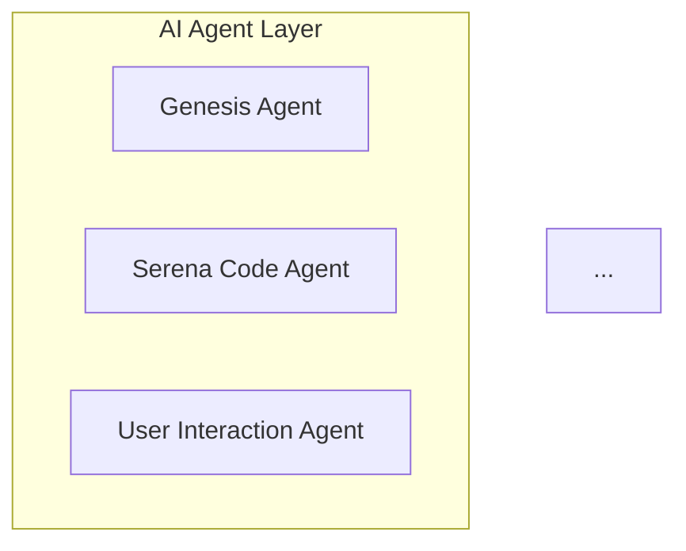
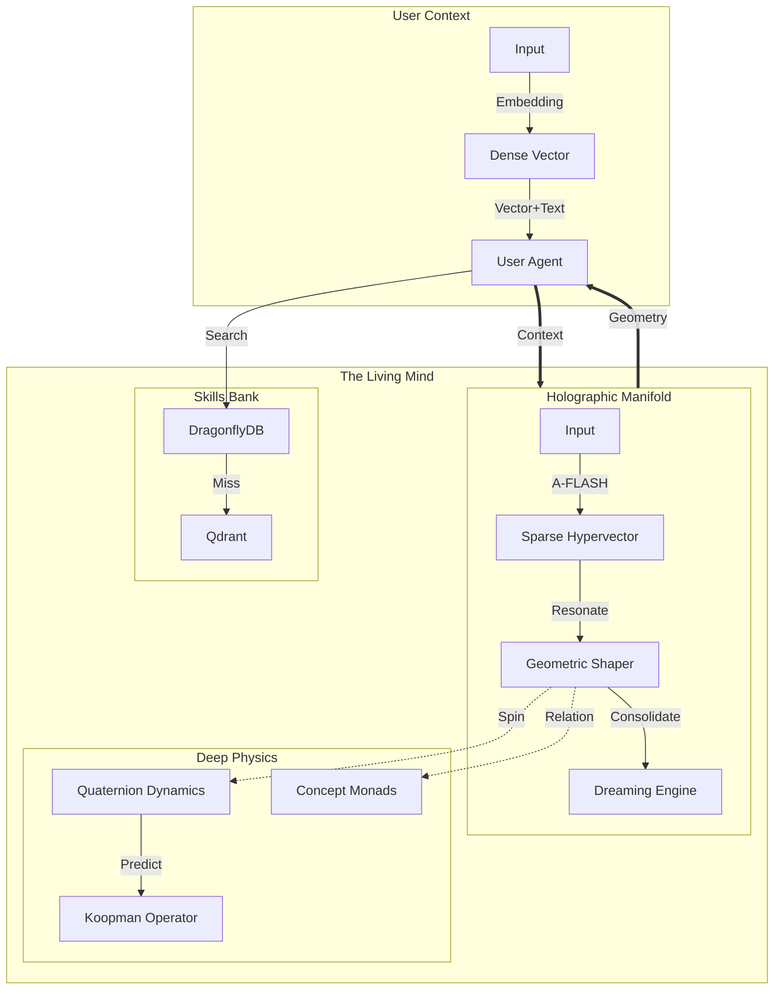

# ARCA Visualization Configuration Reference

This document provides comprehensive guidance on configuring and customizing the ARCA system visualization components.

## Overview

The ARCA visualization system consists of four main panes:

| Pane | Purpose | Technology |
|------|---------|------------|
| **Unified System** | 3D hardware topology with Geometry Kernel | Three.js |
| **Vector Space** | System state vector visualization | Three.js |
| **Services** | Service architecture diagram | Mermaid.js |
| **Workflows** | Process flow sequences | Mermaid.js |

---

## Unified System Pane

### Core Elements

#### Geometry Kernel (Gold Torus)
```javascript
// Location: system-views.js, hardware array
{ id: 'geometry_core', type: 'geometry_core', pos: [0, 2, 0], label: 'Geometry Kernel', detail: 'torus' }
```

**Customization:**
- `torusRadius`: 1.5 (main ring radius)
- `tubeRadius`: 0.5 (tube thickness)
- `scale.y`: 1.8 (elongation factor)
- `opacity`: 0.85 (transparency for inner glow visibility)

**Color Gradient:** Blue (top) → Purple → Pink → Orange (bottom)
- Achieved via vertex colors on the torus geometry

#### Silver Gyroscope Rings
Three nested rings rotating on different axes:
```javascript
ring1: { anim: 'spin_x', radius: 2.2 }
ring2: { anim: 'spin_y', radius: 2.5, rotation.x: π/3 }
ring3: { anim: 'spin_z', radius: 2.8, rotation.z: π/4 }
```

#### Symmetric Endpoints
| Endpoint | Position | Color | LED Type |
|----------|----------|-------|----------|
| Serena Alert | [-8, 1, 0] | Green (0x00ff00) | Health/Alert |
| Loki Logging | [8, 1, 0] | Red (0xff0000) | Log Destination |

### Hardware Nodes

```javascript
const hardware = [
    { id: 'server_main', type: 'server', pos: [-5, 0, -5], label: 'Main Cluster', detail: 'cpu' },
    { id: 'db_node', type: 'database', pos: [5, 0, -5], label: 'Knowledge Graph', detail: 'disk' },
    { id: 'geometry_core', type: 'geometry_core', pos: [0, 2, 0], label: 'Geometry Kernel', detail: 'torus' },
    { id: 'ui_server', type: 'server', pos: [-5, 0, 5], label: 'Interface Node', detail: 'ram' },
    { id: 'monitor', type: 'monitor', pos: [5, 0, 5], label: 'O11y Stack', detail: 'screen' },
    { id: 'serena_alert', type: 'endpoint', pos: [-8, 1, 0], label: 'Serena Alert', detail: 'led_green' },
    { id: 'loki_endpoint', type: 'endpoint', pos: [8, 1, 0], label: 'Loki Logging', detail: 'led_red' }
];
```

**To add a new node:**
1. Add entry to `hardware` array
2. Define `type` handler in the `hardware.forEach` block
3. Add cable connections via `createCable()`

### Cable Connections

```javascript
createCable(startVec, endVec, color);

// Examples:
createCable(new THREE.Vector3(0, 2, 0), new THREE.Vector3(-8, 1, 0), 0x00ff00);  // Core -> Serena Alert
createCable(new THREE.Vector3(0, 2, 0), new THREE.Vector3(8, 1, 0), 0xff0000);   // Core -> Loki
```

**Color Conventions:**
- `0x00ff00` - Green (health/alert connections)
- `0xff0000` - Red (error/log routing)
- `0x0000ff` - Blue (UI connections)
- `0x8b0000` - Deep red (log transport)
- `0xffd700` - Gold (geometry/core connections)

### Animation System

#### Cognitive Tick Pulse
The inner glow of the Geometry Kernel pulses every ~3 seconds:
```javascript
const pulsePhase = (time % 3) / 3;
if (pulsePhase < 0.1) {
    glow.material.opacity = 0.8 * (1 - pulsePhase / 0.1);
}
```

#### LED Endpoint Pulsing
```javascript
serenaAlert.material.emissiveIntensity = 0.5 + Math.sin(time * 2) * 0.3;
lokiEndpoint.material.emissiveIntensity = 0.5 + Math.sin(time * 2.5 + 1) * 0.3;
```

---

## Vector Space Pane

### System State Vector

Displays a 3D representation of the system's internal state dimensions:

```javascript
const stateDimensions = [
    { name: 'Attention', value: 0.7, color: 0x00ffff },
    { name: 'Arousal', value: 0.5, color: 0xff00ff },
    { name: 'Certainty', value: 0.8, color: 0xffff00 },
    { name: 'Urgency', value: 0.3, color: 0xff5500 },
    { name: 'Coherence', value: 0.9, color: 0x00ff00 },
    { name: 'Novelty', value: 0.4, color: 0x5555ff }
];
```

**To add new dimensions:**
1. Add entry to `stateDimensions` array
2. Each dimension creates:
   - A vertical bar (height = value × axisLength)
   - A glowing tip sphere
   - A floating label

**To connect to real data:**
```javascript
// In animate() function, replace simulated variation:
bars.forEach((bar, i) => {
    const realValue = await fetchStateValue(bar.userData.dimension.name);
    // Update bar height based on realValue
});
```

---

## Services Pane (Mermaid)

### Graph Structure



### Adding New Services

1. Add node to appropriate subgraph
2. Define connections with `-->` arrows
3. Apply styling:
```
style NODE_ID fill:#color,stroke:#border,color:#text
```

---

## Workflows Pane (Mermaid)

### Sequence Diagram

Uses Mermaid sequenceDiagram syntax:

```mermaid
sequenceDiagram
    participant U as User
    participant UI as User Interaction
    ...
    U->>UI: Submit Request
    Note over COG,GEO: Cognitive Processing
```

---

## Query Function Usage

### Unified System Overlay

Located in bottom-left of Unified System pane:

```
❯ [Query input field] [SEND]
```

**Usage:**
1. Type a query like "Find concept API"
2. Press Enter or click SEND
3. System responds with vector alignment feedback

**Backend Integration:**
```javascript
// In submitQuery(), replace mock response:
const response = await fetch('/api/geometry/query', {
    method: 'POST',
    body: JSON.stringify({ query })
});
```

---

## Representation Suggestions

Given the available tools, here are optimal representations:

| Data Type | Recommended Representation |
|-----------|---------------------------|
| Service Relationships | Mermaid graph (Services pane) |
| Process Flows | Mermaid sequence (Workflows pane) |
| System Topology | 3D hardware nodes (Unified pane) |
| State Vectors | 3D bar visualization (Vector Space) |
| Real-time Metrics | LED brightness + cable pulses |
| Log Events | Particle flows along red cables |
| Alerts | Green LED pulse to Serena Alert |
| Errors | Red LED activation + cable pulse to Loki |

### Future Enhancements

1. **HSE Hypervector Orbits**: Render hypervectors as orbiting particles
2. **Force Field Visualization**: Show concept attraction/repulsion
3. **Drag-and-Drop Nodes**: Interactive node repositioning
4. **Real-time Backend Data**: WebSocket-driven state updates
5. **Concept Labels on Torus**: Tick labels scrolling on torus surface

---

## Living System Pane (Mermaid)

### OCI Architecture Diagram
*This visualizes the deep physics and data flow between Local and OCI Cloud.*



---

## Holographic Resonator (Conceptual)

To visualize HDC Vectors (10,000 bits) and frequency:

### The Frequency Cylinder
Instead of raw bits, render the vector as a **Spectral Cylinder**:
*   **Shape**: A transparent cylinder representing the 10,000 dimensions wrapped in a circle.
*   **Data**: The "Active Bits" (1s) appear as glowing pixels on the surface.
*   **Motion (Frequency)**: The cylinder spins. The speed of spin represents the **System Frequency** (from Koopman Operator).
    *   Fast Spin = High Cognitive Load / rapid association.
    *   Slow Spin = Deep consolidation / dreaming.
*   **Pulse**: The cylinder pulses with **Rotational Energy** ($E_{rot}$). A sudden topic shift causes a "Shockwave" ripple across the surface.

This allows you to "See" the thought process:
*   **Stable Thought**: A smoothly spinning, steady pattern.
*   **Confusion**: A chaotic, jittery cylinder with shockwaves.
*   **Learning**: New pixels lighting up and "locking in" to the pattern.

---

## Living System Pane (Mermaid)

### OCI Architecture Diagram
*This visualizations the deep physics and data flow between Local and OCI Cloud.*

```mermaid
graph TD
    %% Subgraph: Local Reality (MacBook/Agent)
    subgraph Local_Reality [User Context (Local Mac)]
        User[User Input (Text)] -->|Embedding| DenseEncoder[Dense Vector Encoder]
        DenseEncoder -->|Dense Vec| AgentCore[User Interaction Agent]
        User -->|Text| AgentCore
        AgentCore -->|Act| ToolUse[Local Tools (Files, Git)]
        
        %% Proprioception Feedback
        AgentCore -.->|Proprioception| SystemState[System Metrics]
    end

    %% Subgraph: OCI Cloud (The Living Mind)
    subgraph OCI_Cloud [Living System (OCI Ampere)]
        
        %% Service: Conversational HDC (The Manifold)
        subgraph HDC_Manifold [Holographic Manifold]
            direction TB
            InputBuffer[Input Buffer]
            GeometricShaper[Geometric Shaper (Manifold)]
            DreamingEngine[Dreaming Engine (Consolidator)]
            
            InputBuffer -->|Dense -> Sparse| AFLASH[A-FLASH Projector]
            AFLASH -->|Sparse HV| GeometricShaper
            GeometricShaper -->|Recursive Update| DreamingEngine
            DreamingEngine -->|Long Term| GeometricShaper
        end
        
        %% Service: Physics Kernel (The Dynamics)
        subgraph Physics_Kernel [Deep Physics]
            direction TB
            Quaternions[Quaternion Dynamics (Rotation)]
            Koopman[Koopman Operator (Prediction)]
            Monads[Concept Monads (Relation)]
            
            GeometricShaper -.->|State| Quaternions
            Quaternions -->|Stability Check| Koopman
            Monads -->|Kuramoto Field| Quaternions
        end
        
        %% Service: Skills Layer
        subgraph Skills_Layer [Skills Bank]
            Dragonfly[DragonflyDB (Hot Pattern)]
            Qdrant[Qdrant (Deep Associative)]
            
            AgentCore -->|Search| Dragonfly
            Dragonfly -->|Miss| Qdrant
            Qdrant -.->|Holographic Link| Monads
        end
        
    end

    %% Connections
    AgentCore ==>|1. Context Request (Dense + Text)| InputBuffer
    GeometricShaper ==>|2. Geometric Context (Text)| AgentCore
    
    %% Fields Overlay
    subgraph Fields [Overlapping Fields]
        style Fields fill:#f9f,stroke:#333,stroke-width:2px,fill-opacity:0.1
        Kuramoto[Kuramoto Field (Empathy/Sync)]
        Fisher[Fisher Information (Curiosity)]
        
        Kuramoto -.-> Monads
        Kuramoto -.-> User
        Fisher -.-> Koopman
    end
```
